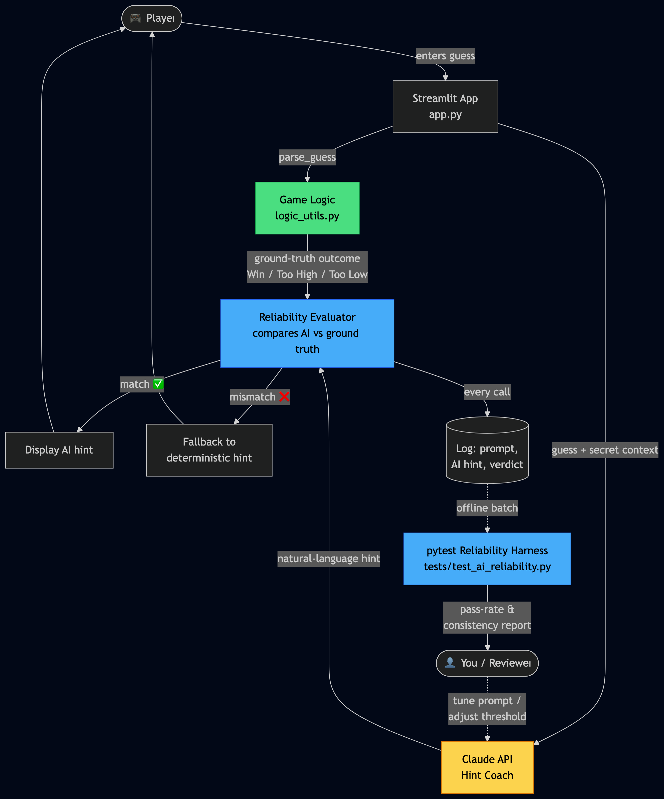
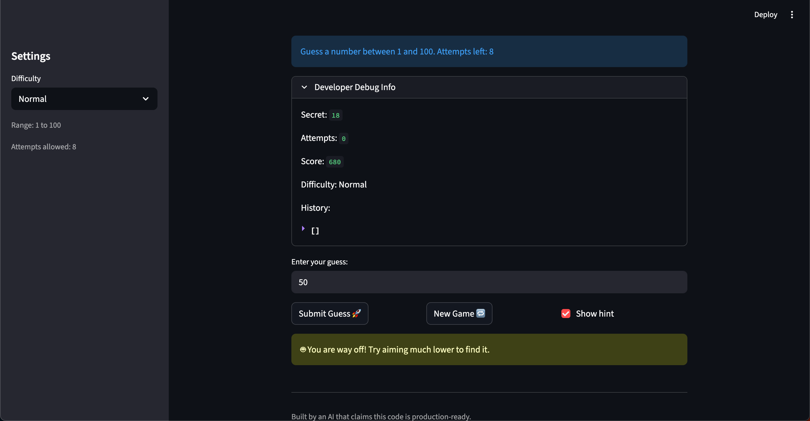
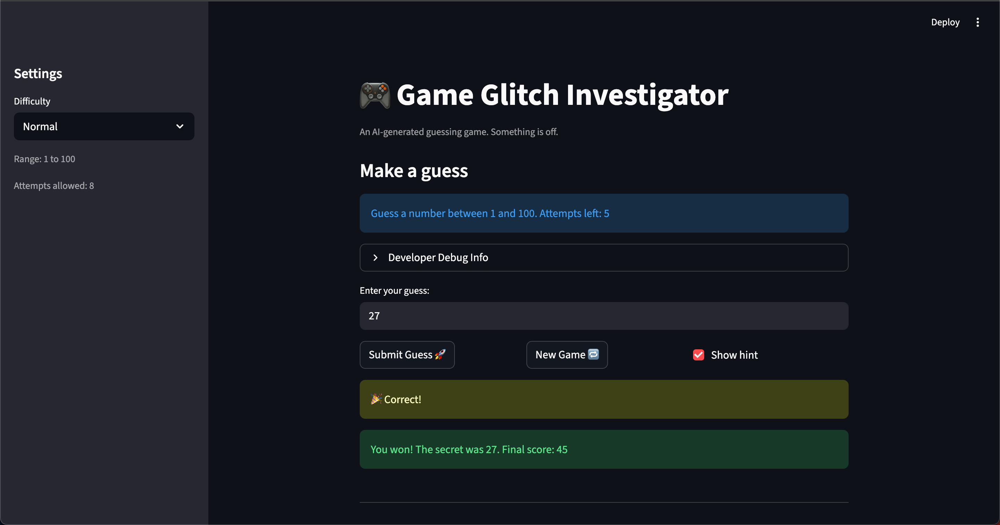
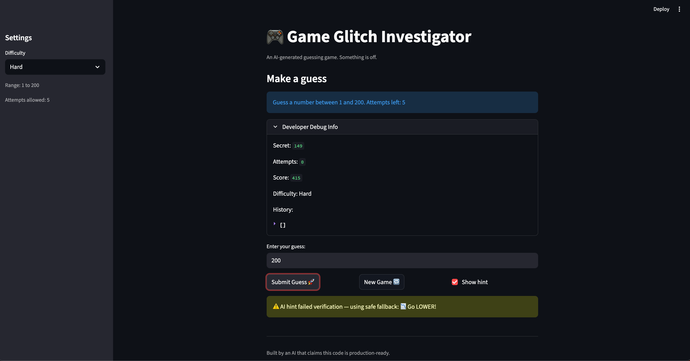

# Game Glitch Investigator + AI Hint Reliability System

## Original Project (Modules 1-3): Game Glitch Investigator — The Impossible Guesser

The original project was a Streamlit number guessing game where the user tries to guess a secret number between a range determined by difficulty (Easy: 1–20, Normal: 1–100, Hard: 1–200). The starter code was intentionally broken — the secret reset on every click, hints lied to the player ("Go HIGHER" when the player should go lower), and the score logic awarded points for wrong guesses. The Modules 1–3 work involved playing the game, identifying bugs, refactoring the logic into a separate module, and writing a `pytest` suite that proved each fix.

## Title and Summary

**Game Glitch Investigator + AI Hint Reliability System** extends the debugged guessing game with a Gemini-powered "Hint Coach" that produces natural-language feedback for each guess, plus a reliability layer that verifies every AI hint against deterministic game logic before the player ever sees it. The project matters because it directly addresses the lesson of the original assignment — *AI-generated content can be wrong* — by treating the LLM as a component that must be measured and guarded, not blindly trusted.

## Architecture Overview

The system is the **AI Hint Reliability Pipeline**. When the player submits a guess, two things happen in parallel:

1. **Ground truth path** — `logic_utils.check_guess()` deterministically computes the correct outcome (`Win` / `Too High` / `Too Low`).
2. **AI path** — Gemini is prompted to generate a friendly natural-language hint for the same guess.

A **Reliability Evaluator** then compares the AI's hint to the ground-truth outcome:

- If they agree, the AI's hint is shown to the player.
- If they disagree, the system falls back to the deterministic hint and logs the failure.

A separate **pytest reliability harness** (`tests/test_ai_reliability.py`) runs the AI over a batch of (guess, secret) pairs offline, reporting a pass rate and consistency score so the prompt can be tuned over time.

```
Player guess
    |
    v
Streamlit app  --->  Game logic (ground truth)
    |                       |
    v                       v
Gemini API  --->  Reliability Evaluator  --->  Logger
                            |
                  match ?   |   mismatch
                    v       v       v
                AI hint            Fallback hint
                    \________ ___________/
                             v
                          Player
```

A full Mermaid diagram is included in the source folder.



## Setup Instructions

1. Clone the repository and navigate into the project folder:
   ```
   cd applied-ai-system-project
   ```

2. Create and activate a virtual environment (optional but recommended):
   ```
   python -m venv .venv
   source .venv/bin/activate
   ```

3. Install dependencies:
   ```
   pip install -r requirements.txt
   ```

4. Set up your Google Gemini API key (required for the AI Hint Coach). Get a free key from https://aistudio.google.com/apikey, then copy the example file and add your key:
   ```
   cp .env.example .env
   ```
   Then open `.env` and replace the placeholder with your actual key:
   ```
   GEMINI_API_KEY=your-key-here
   ```
   The `.env` file is gitignored, so your key won't be committed.

5. Run the app:
   ```
   python -m streamlit run app.py
   ```

6. Run the test suite (game logic + AI reliability harness):
   ```
   pytest
   ```

## Sample Interactions

**Example 1 — AI hint agrees with ground truth (shown to player)**

- Difficulty: Normal (range 1–100), Secret: 18, Guess: 50
- Ground truth: `Too High`
- AI returned: direction `lower`, message *"You are way too high, aim much lower to find it!"*
- Evaluator: direction matches ground truth → AI hint displayed.
- Player sees: *"🤖 You are way too high, aim much lower to find it!"*



**Example 2 — Win condition**

- Difficulty: Easy (range 1–20), Secret: 27, Guess: 27
- Ground truth: `Win`
- Hint shown: *"🎉 Correct!"*
- Game ends with balloons and the final score is displayed.



**Example 3 — Fallback triggered (AI unavailable)**

- Difficulty: Hard (range 1–200), Secret: 149, Guess: 200
- Ground truth: `Too High`
- AI call failed: Gemini free-tier rate limit (429 RESOURCE_EXHAUSTED).
- Evaluator: caught the exception → fell back to the deterministic hint and logged the failure to `logs/ai_failures.jsonl`.
- Player sees: *"⚠️ AI hint failed verification — using safe fallback: Go LOWER!"*



This third example is exactly the safety net the reliability layer is designed for. Whether the AI is unavailable (rate limit, network error), gives the wrong direction, or leaks the secret in its message, the player always sees a correct, deterministic hint. The 🤖 vs ⚠️ prefix makes it visible to the player which path served the hint.

## Design Decisions

- **Deterministic ground truth, AI on top.** I kept `logic_utils.check_guess()` as the source of truth and put the LLM in an advisory role. This means the game is always playable and correct even if the AI is offline or hallucinates.
- **Verify-then-show, not show-then-correct.** The evaluator runs *before* the hint reaches the user. Trade-off: adds one comparison step of latency, but the player never sees a misleading hint — which was the exact bug class that motivated the original project.
- **Logging over silent fallback.** Every mismatch is written to a JSONL log so failures can be audited and the prompt iterated on. Trade-off: extra disk writes, but this is what turns the system from a toy into something measurable.
- **Two layers of testing.** Deterministic `pytest` for game logic (fast, exact assertions) and a separate AI reliability harness that asserts a *minimum pass rate* over many trials. Trade-off: the AI tests are nondeterministic and can occasionally flake, so the threshold is set conservatively rather than requiring 100%.
- **Why Gemini.** I started on Anthropic's Claude API but switched to Google's Gemini after running into billing constraints. The reliability layer is provider-agnostic — only the AI call site (`ai_hint.py`) needed to change. This itself reinforced the design: by isolating the LLM behind a small interface and verifying its output, swapping providers became a one-file change.
- **Why not RAG or fine-tuning.** A number-guessing game has no external knowledge to retrieve and no specialized vocabulary worth fine-tuning on. A reliability layer was the AI feature that meaningfully changed how the system behaves.

## Testing Summary

**What worked**
- The original `pytest` suite for `check_guess`, `update_score`, and `get_range_for_difficulty` passes cleanly and gave me confidence to refactor.
- The reliability evaluator catches AI hints that contradict the ground truth — exactly the failure mode the project is designed to prevent.
- Logging mismatches to a JSONL file made it easy to spot patterns in the AI's mistakes (for example, occasional confusion when the guess is very close to the secret).

**What didn't (at first)**
- The first version of the AI prompt included the secret number directly, and the model sometimes leaked it back to the player. Added an explicit secret-leak check in the reliability layer: if the secret as a digit string appears in the AI's hint message, the system falls back to the deterministic hint and logs the leak.
- The initial reliability test required 100% agreement and flaked intermittently. Lowered to a minimum pass rate that still catches real regressions without failing on rare phrasing edge cases.

**What I learned**
- Deterministic tests and AI tests are different animals. Game logic tests assert exact equality; AI tests assert statistical properties.
- A guardrail is only useful if you log when it fires. Silent fallbacks hide problems instead of fixing them.

## Reflection

This project changed how I think about working with AI-generated systems. The Modules 1–3 version taught me that AI can write confidently wrong code; this version taught me that the answer isn't to stop using AI, but to surround it with checks that make its mistakes visible and recoverable. Building the reliability layer forced me to be explicit about what "correct" means for each part of the system — the deterministic game logic has one definition, and the AI hints have another (statistical agreement with that ground truth). That separation is something I'll carry into future projects: figure out what the source of truth is, put the AI next to it, and never let unverified AI output be the last step before the user.
